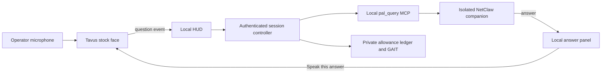

# NetClaw Pal — local avatars and optional Tavus

Local Avatar is the delivered spec 144 feature. Hosted Tavus is experimental, disabled by default, and has not passed a live conversation/billing acceptance test. See [closeout evidence](../specs/144-tavus-netclaw-pal/verification.md).

## Local John and Lobster

Choose **Avatar**, the fourth Chat interface beside **Chat**, **Canvas** and
**OpenClaw**. Choose **John** (a stylized likeness based on the supplied
portrait) or **Lobster**. The desktop layout keeps the avatar on the left and Chat
on the right, with character selection and voice controls below the avatar.
Drag to rotate, scroll/pinch to zoom, and right-drag to pan. Camera buttons also
provide rotate, zoom and reset. Focus the viewport to use arrow keys to rotate,
Shift-arrows to pan, +/- to zoom and Home to reset. Narrow screens stack the
panels. Offscreen avatars pause rendering; Retry 3D recovers a lost graphics
context without resetting Chat.

This uses the **same Chat component, configured frontier model, conversation,
history and existing approvals** as the normal Chat view. There is no second
avatar brain, separate model account or Tavus call in the local path. Changing
characters does not change the model or reset the conversation. The avatar is
an AI presentation of this owner's Claw, not a live connection to John.

Sending a message in Avatar activates local audio during that user gesture.
**Enable voice** plays a greeting or the latest reply notice immediately. On macOS the HUD host uses its
installed system voice to produce a WAV; the browser plays it and animates the
mouth from the actual audio amplitude. Both characters blink and move while
idle. This is reactive animation, not phoneme-accurate lip-sync or John's cloned
voice. Blender authors the asset; the browser renders it, so end users do not
need Blender installed.

Automatic speech defaults to a fixed brief status; private answer details stay
in Chat. **Read latest reply** explicitly speaks the full current answer locally.
**Read full replies aloud on this device** opts into automatic full-answer
playback; anyone nearby can hear it. Spoken text removes Markdown decoration, keeps fenced code and links in Chat,
and splits long answers into clips of at most 1,800 characters. Answers above
8,000 spoken characters receive the brief status instead. Playback settings
provide volume and 0.75–1.25× synthesis speed; choices persist in this tab.
Stop or Escape, conversation changes, navigation, avatar changes and hiding the
tab cancel playback and remaining clips. Speech generation is authenticated, one request at a time, bounded to
30 seconds per subprocess, and cleans up its private temporary files. There is
no hosted voice fallback. Other operating systems currently show voice as
unavailable while keeping text chat and avatars usable.

Dedicated microphone/STT and cloned voice are follow-on work. You can use your
operating system's dictation to fill the existing composer and review before
sending. Local avatar/speech has no avatar-provider charge; the configured
frontier model's normal usage still applies.

The gateway's authenticated loopback chat endpoint must be enabled for both
Chat and Pal. If the HUD says unavailable, check `/api/gateway/status` and the
gateway process; do not mistake a rendered local character for a live agent.

## Recording John's voice

Keep a clean **WAV master**; MP3/M4A can also be used where the selected engine
accepts them. Aim for **60–120 seconds** in a quiet room, with one speaker,
normal pacing, no music and no aggressive noise processing. That is a practical
capture target, not a universal model/provider minimum. A clean short excerpt
can later be selected for a local cloning model. Cloning remains unimplemented.

There is no microphone recorder in the coding chat. On this Mac, Audacity is
installed: record there and save `~/.openclaw/pal/voices/john/master.wav`; a derivative MP3 can be
made afterwards. Neither saving the file nor recording authorizes uploading it
to a hosted provider. Suggested material (add another minute in your own words):

> Hi, I'm John, and this is NetClaw. Let's take a look at the network together.
> First, we'll check what is actually happening. Then we'll compare the evidence
> with what we expected to see. Is the problem affecting one device, a whole
> site, or a particular application? When did it start, and what changed around
> that time? We might look at routing, interface counters, latency, packet loss,
> and the path between two endpoints. BGP and OSPF give us different views of
> how traffic should move. A healthy session does not always mean a healthy
> service. If a result is unclear, I'll say so. Before making a change, we'll
> review the plan, capture a baseline, and make sure approval is in place.
> Afterward, we'll verify the result and keep a useful record. All right—what
> would you like to investigate today?

### Own-voice engine recommendation

Start with **Qwen3-TTS 0.6B Base via MLX Audio**: reference audio plus its exact
transcript can condition a voice without a training run. Capture the WAV above;
we can select a clean 10–20 second excerpt for the first trial. The Base model
is Apache-2.0; MLX Audio documents its Apple Silicon cloning path. Performance
and voice similarity on this Mac remain unmeasured. Apple voice is still the
only installed playback engine. See the [research and integration plan](../specs/144-tavus-netclaw-pal/research.md#local-own-voice-decision--2026-10-09-ralph-pass-9).

Sources: [Qwen Base model](https://huggingface.co/Qwen/Qwen3-TTS-12Hz-0.6B-Base),
[MLX Audio guide](https://github.com/Blaizzy/mlx-audio/blob/main/docs/models/tts/qwen3-tts.md).

## Shared avatar format and future imports

Built-ins are original locally generated assets under `ui/netclaw-visual/public/pal`.
Rebuild with `blender --background --factory-startup --python scripts/build-pal-avatars.py`.
This runs in a fresh background scene; it does not overwrite a live Blender
document. Blender MCP can author the same assets when its addon is connected.

The prototype contract is `netclaw-pal-nodes-v1`: embedded GLB, meters, glTF Y-up,
face toward +Z, feet/base near zero, and animated nodes `pal_root`, `pal_head`,
`pal_mouth`, `pal_eye_left`, `pal_eye_right`. Optional `pal_jaw` and hand nodes
add secondary motion. Mouth opening scales local Y; eyes scale local Y to blink.
Each profile names a built-in ID, GLB and preview. Both rigs are tested against
this contract, with a 5 MiB asset ceiling and no external buffers/textures.

**Custom upload and external conversion are deliberately deferred until the
two-character formula is accepted.** A future importer must validate rig,
dimensions, node/resource limits, embedded resources, file contents and asset
rights before activation. A photo alone is not a rigged GLB. The future external
Blender script should export this same contract; it must not accept arbitrary
uploaded scripts for server execution.

## Optional hosted Tavus foundation

Under **Optional Tavus video service**, a Tavus stock face handles
speech; a local MCP facade asks a dedicated NetClaw agent for an answer. This
first slice explains concepts and synthetic scenarios. **All agent tools are
denied. Device reads, changes, the main agent's memory and operational skills
are not available through this Tavus mode yet.** Hosted live playback acceptance
is still pending. These restrictions do not describe the local Chat-based Pal above.



No public callback, tunnel or unrestricted agent endpoint is published. The
browser carries app messages between the private Daily room and the local HUD.
The facade is deliberately absent from the main agent's MCP registry: registering
an agent-to-agent facade there would allow recursive dispatch. The optional
installer component is `tavus-pal`.

## Your smiley or lobster

In **Avatar → Optional Tavus video service → Use your own local icon**, choose a PNG/JPG under 250 KB. It is stored
in this browser only and is displayed before joining. It is not uploaded to
Tavus and does not replace the live stock face.

The Free plan includes stock faces, not custom face training. Tavus's current
image path accepts adult human-shaped faces (including some illustrated humans),
not animals or mascots. A lobster is therefore unsuitable for that path. A photo
of your smiling face may meet the image requirements, but custom training falls
outside this Free experiment. See [pricing](https://www.tavus.io/pricing) and
[image requirements](https://docs.tavus.io/sections/faces/phoenix-45-image-requirements).

## Prepare locally

Use Node 22.14 or newer supported LTS and Python 3.10+. From the repository root:

```sh
python3 -m venv mcp-servers/tavus-pal-mcp/.venv
mcp-servers/tavus-pal-mcp/.venv/bin/python -m pip install -r mcp-servers/tavus-pal-mcp/requirements.txt
npm --prefix ui/netclaw-visual ci
python3 scripts/pal-prepare-agent.py --enable-http
```

The last command is a dry run and prints no credentials. It checks the installed
runtime's `agents.list` format and proposes `netclaw-pal`, a private bootstrap
workspace and `tools.deny: ["*"]`. It preserves the default main agent. To apply
that reviewed local configuration, run:

```sh
python3 scripts/pal-prepare-agent.py --enable-http --apply
```

A private timestamped backup is written first. The script refuses an existing
Pal agent/workspace rather than replacing it. It does not restart OpenClaw.
Reload/restart the gateway using your normal local procedure, then validate its
configuration. The facade requires the authenticated loopback
`/v1/chat/completions` endpoint and fixed `netclaw-pal` routing. It refuses a
missing agent, weakened tool deny policy, changed bootstrap or added memory.
The installed runtime's tool deny policy applies without Docker; actual live
gateway dispatch remains an acceptance check.

## Prepare Tavus without using video minutes

The server and CLI read `TAVUS_API_KEY` from repository `.env` or the runtime
environment. Never put it in browser code. The runtime `.env` takes precedence
over repository `.env`; process environment takes precedence over both.

```sh
node scripts/pal-settings.mjs status
node scripts/pal-settings.mjs faces
```

These commands expose only configuration booleans and stock inventory. In
[Tavus Maker](https://maker.tavus.io/dev/home), check the current Free balance and
that the selected stock face, PAL creation and app-message tools are included.
Inventory access alone does not prove these entitlements. Do not activate paid
features or assume that the 20-minute allowance resets automatically.

After checking, replace `STOCK_FACE_ID` with an eligible listed ID:

```sh
node scripts/pal-settings.mjs provision --face STOCK_FACE_ID --free-plan-confirmed
node scripts/pal-settings.mjs verify
```

Provisioning creates one tool and one PAL, attaches them and stores their IDs in
the private runtime `.env`. It does not create a conversation. It leaves
`NETCLAW_PAL_ENABLED=false`. If any mutation fails or times out, inspect Tavus's
tool/PAL inventory before trying again; partial setup may have succeeded.
No upgrade or automatic retry is performed.

The registered tool uses app-message delivery, `origin: llm`, `trigger_type:
in_call`, `on_call: static_filler`, and `on_resolve: response_in_result`.
Speculative inference and perception are off. `verify` checks this restricted
profile, the single tool and stock inventory; it cannot prove account balance,
billing bounds or live playback. Contract reference:
[tool delivery](https://docs.tavus.io/sections/conversational-video-interface/pal/llm-tool-delivery).

## First bounded call

Set `NETCLAW_PAL_ENABLED=true` in the local runtime `.env` after preparation.
Open the HUD's **Pal** destination. Opening or refreshing never starts a call.

1. Check Tavus's current balance and billing behavior. In **Confirm Free
   allowance**, enter the remaining seconds and confirm the displayed bounds.
   If you cannot establish that the provider's cap and cleanup bound usage,
   leave Pal disabled. Do not use the same account elsewhere during the trial.
2. Select **Start two-minute call**. Camera, screen sharing and recording are
   off; microphone audio goes to Tavus. Ask a synthetic question such as
   “Explain the difference between OSPF and BGP.”
3. Review the NetClaw answer locally. **Speak this answer** sends that exact
   stored text to Tavus for playback. Automatic tool results contain only a
   fixed completion/unavailability notice, never generated answer text.
4. End the call. Verify ended status and usage in Tavus and record the observed
   response latency, playback behavior and cleanup time before declaring the
   integration accepted.

Tavus may generate its own greeting or filler. That is not a NetClaw observation.
Free video minutes do not cover the separate model used by NetClaw. Disabling
recording is not a guarantee of zero provider retention.

## Limits and interrupted calls

- One unresolved conversation per runtime ledger. The provider cap is 120
  seconds, with a 30-second absent-participant timeout and immediate end after
  participant departure. No reconnect creates a replacement call.
- Each start consumes a conservative **180-second reservation**: 120 seconds
  plus a 60-second cleanup cushion. This cushion is a project assumption to
  verify, not a provider guarantee. Reservations are never automatically
  refunded. The experiment stops at the smaller of 1,200 seconds and the
  confirmed remainder: at most six normal trials with this reserve.
- Balance confirmation expires after 15 minutes, is tied to the HUD session
  and permits one start. Reconfirming can lower the balance but cannot refill
  the experiment. Other account use must reduce the next confirmation.
- Refresh, lost create responses and failed end requests retain reservations.
  **Reconcile previous call** finds only the exact server-assigned name and
  confirms provider termination. An ambiguous or missing match stays blocked.
- Cleanup also runs every five seconds on the server for overdue known calls.
  Provider duration/absence caps are the fallback if the browser/server dies.
  GAIT failure stops new starts/questions but does not block cleanup.
- State lives in `~/.openclaw/netclaw-pal/ledger.json` (private permissions).
  Never delete/reset it to recover allowance. A stale lock requires inspection
  of the interrupted process, ledger and provider history before removal.
  Losing the owning HUD cookie requires local operator recovery; a new cookie
  cannot take over another session. Multiple hosts sharing a Tavus account
  must not run independent Pal ledgers.

Turns are serialized and deduplicated, limited to 1,000 characters and a 3 KB
UTF-8 event; speech events have the same byte cap. There is no private evidence
polling/resume interface in this slice. Local answers remain in the ledger;
expired calls cannot send late results or approve speech into a new room.

## Validation and remaining work

Local fixtures cover budget, ownership, revocation, replay, provider contracts,
unavailable audit/gateway, cleanup and private output separation. They do not
prove a live Tavus/Daily or model round trip. See
[spec 144 tasks](../specs/144-tavus-netclaw-pal/tasks.md) and
[implementation evidence](../specs/144-tavus-netclaw-pal/implementation-evidence.md).
Operational read tools require a further reviewed allowlist, target binding and
live prerequisites; they remain disabled in this implementation.
