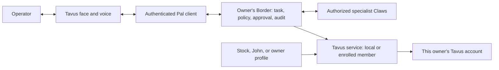

# Pal distribution and Border integration — agreed direction

Updated: 2026-10-09. This extends spec 144 following the owner's clarification.
The original hosted explanation-only slice remains implemented and disabled.
After comparing costs, the owner authorized a local-first prototype: John and
Lobster as two selectable characters, with the configured frontier model
producing answers and local speech/animation presenting them. This is now the
fourth **Avatar** interface alongside Chat, Canvas and OpenClaw. Custom avatar
imports/conversion, voice cloning and hosted member placement remain future
work. The Tavus distribution design below is the optional hosted expansion.

## Local-first prototype

Blender generates original rigged GLBs; existing Three.js renders them in the
HUD. Blender MCP can author these when connected; the current build used an
isolated Blender CLI because the addon was not listening. John is stylized
from the supplied portrait, not a photorealistic reconstruction. The lobster
uses the same named-node rig. The browser supports rotate, pan, zoom and reset.

Existing StandardChat supplies its authenticated conversation, model settings,
history and approval behavior unchanged. An authenticated local macOS voice
adapter returns bounded WAV audio. Mouth motion follows audio amplitude; idle
blinks/head motion are scripted. No extra language model is needed to render
the character. Default speech is a fixed non-sensitive status; full local
read-aloud is explicit. A dedicated local microphone workflow, viseme alignment
and cloned voice require separate implementation/benchmarking.

This avoids an avatar-service subscription but retains the configured frontier
model's ordinary costs. Alternatives reviewed include HeyGen LiveAvatar (Free
preset avatars, paid custom avatars), TalkingHead (browser GLB/viseme renderer),
whisper.cpp (local transcription), MLX Audio and Chatterbox (local speech model
candidates). No model installation or cloning has been performed. Existing
Three.js plus Mac system speech is the chosen first implementation.

Local speech generated a 3.3-second clip in 1.33 seconds; the HTTP adapter also
returned valid WAV. This is one synthetic sample, not a latency guarantee.
Custom uploads/conversion follow after the two-character formula is accepted.
See [user guide](../../docs/TAVUS-PAL.md) for the rig contract and recording script.

## Decisions answered by the owner

1. Free is the default. Custom faces and voices are optional for accounts with
   the required entitlement. No account upgrade is authorized by this design.
2. Every installation supplies its own Tavus API key and owns its usage bill.
   No shared John API key or centrally subsidized conversations ship in NetClaw.
3. Pal uses the full authorized local NetClaw through Border. Existing identity,
   target scope, change approval, verification and audit remain authoritative.
4. An optional downloadable John media pack may contain the approved photo and
   voice recording so recipients can train their own Tavus resources. The owner
   explicitly understands that recipients will possess those source files.
5. Non-sensitive summaries may speak automatically. Private network details
   remain local. Speech does not approve a configuration change.

## One service, two deployment placements

**Default: Border capability.** When enabled, Pal is a communication capability
on the local Border (including standalone NetClaw). It appears in capability and
status views with configuration, availability, selected profile and allowance.
An API key alone must not advertise it as ready or start a call.

**Optional: Tavus member.** The same provider service can be hosted by an enrolled
`tavus` specialist member with only Tavus credentials and lifecycle/profile
tools. Border remains the human entry point and routes provider work to that
member. It does not become a second unrestricted Border or own network change
approval. Model reasoning and device work continue through normal Border routing.

The face is presentation, not authority. John's own avatar answers through John's
Claw. An installation choosing the John pack answers through **that owner's**
Claw. Neither a likeness nor a profile ID grants access to John's devices,
memory, API key or agent sessions. Label the default identity as an AI avatar
used by the local NetClaw, not a live conversation with John.

## Separate three configuration objects

| Object | Contains | Location |
|---|---|---|
| Avatar profile | Name, greeting, languages, portrait, voice source, attribution, pronunciation preferences | Versioned profile/optional media pack |
| Provider account | API key, account-specific PAL/face/voice IDs, entitlement evidence, budget policy and ledger | Private runtime storage on the service host |
| Claw binding | Border identity, authenticated operator, session/task mapping, selected scopes and speech export policy | Existing local/federated authorization boundary |

Use one provider adapter, one lifecycle controller and one profile resolver for
all three profile choices. Keep preset data out of agent/provider code. The
current dedicated Pal source and tests total 968 lines; this extension should
reuse the existing framework, not create separate implementations for John and
every owner or rewrite the surrounding HUD/federation code.

## What ships

- **Free starter:** service disabled initially; eligible stock face and voice
  selected during setup. The operator activates it with their own key and
  confirmed allowance. No training runs during install.
- **John preset:** versioned identity/greeting/attribution and an optional
  downloadable approved media pack. Choosing it on an entitled account provisions
  resources in that account and stores the resulting IDs privately.
- **Personal preset:** the same setup accepts an owner's media or existing
  account-owned resource IDs. Changing the likeness does not change Claw scope.

A John portrait/branding preview can be bundled without claiming that the live
stock video depicts John. If John is selected but custom training is unavailable,
setup must explain this and offer a clearly labeled stock fallback. Do not
silently substitute a different talking face while calling it John.

Tavus's face catalog is account-associated, with user and system face types.
No documented cross-account distribution guarantee was found for a custom
`face_id` or `voice_id`. A resource ID from John's account is therefore not a
portable default. Recreating the approved pack per entitled owner account is
the chosen initial distribution model. Tavus-managed shared/stock access could
be investigated later; no support outreach has been authorized or sent.

## Setup inputs

| Input | Supported proposed onboarding behavior |
|---|---|
| Tavus API key | Server-side secret entry; masked verification; never part of the pack or browser bundle |
| Existing PAL / face / voice | Select from the owner's account and validate compatibility; avoid unnecessary retraining |
| Photo | JPG or PNG; at least 512×512; one adult human-shaped subject, visible face and suitable portrait framing |
| HEIC source | Normalize orientation and convert locally to JPG/PNG before provider upload; strip metadata from distributed derivatives |
| Voice recording | Accept WAV, MP3 or M4A in the first setup UI; Tavus's API also documents FLAC, OGG/OGA, WebM, MP4 and MOV |
| Training video | Optional later alternative following the chosen Phoenix model's footage/rights requirements; video training also derives a voice |
| Profile settings | Display name, greeting, language and networking pronunciation preferences |
| Knowledge/context | Use the owner's existing NetClaw workspace/RAG and scope; do not upload network configs, topology or credentials to Tavus |

The supplied `docs/john.HEIC` was inspected locally: 4032×3024 source pixels with
portrait orientation, one visible person and a clear face. It is a candidate,
not a provider-approved training asset. At the owner's subsequent request,
`docs/john.png` was converted with macOS sips and visually verified locally.
The original remains untouched. Neither image was uploaded. Distribution still
requires a metadata review and an explicitly prepared release derivative.
Tavus notes that dense beards can affect results, so the eventual audition must
check mouth motion and likeness. No retouching or identity alteration is required
for the initial preparation step.

The John voice recording is still missing. A practical recording target is one
to two minutes of natural speech in a quiet room, including networking terms;
this is our capture recommendation, not a published Tavus minimum. Use the
speaker's normal voice with no music or other speakers. Confirm provider
validation, audition the trained result and poll until the voice is ready.

The API takes provider-reachable training URLs rather than reading local paths.
For the first release, support training through Tavus Maker then importing IDs;
integrated uploads require a reviewed temporary asset-transfer/storage flow.
No automatic public hosting of arbitrary local files. Optional public John
release assets may supply stable URLs once actually published. The pack needs
version/hash metadata, attribution and terms scoped to the owner's authorized
NetClaw avatar use; do not automatically apply the repository's software license
to the owner's likeness/audio.

## NetClaw execution and automatic speech

Replace the explanation-only agent path with authenticated Border task ingress
in a later implementation stage. Bind each conversation to its actual operator
and a fresh, server-selected task/session. Pass the user request through normal
Border routing and existing tool authorization, not an unrestricted direct
Tavus-to-MCP listener. Keep the Pal ingress facade out of Border's callable tool
catalog to avoid recursive agent calls; a Tavus member exposes provider work.

Full authorized access is not full unattended access. Production changes still
need the existing approved change record, baseline and verification. Local/Lab
requests must use the existing explicitly opted-in API workflow. Voice assent
must not mint an approval or convert an inquiry into a change request.

Automatic speech comes from an explicit public-response contract:

- public explanations that have not been conditioned on private evidence;
- deterministic task-state notices and approved non-sensitive summary fields;
- links and detailed evidence rendered in the local HUD only.

Do not take an arbitrary Border answer containing private evidence, ask another
LLM to redact it and treat that as a reliable export boundary. Unexpected fields,
raw tool outputs, device identities, addressing, configs, topology, memory and
credentials stay local. A schema/allowlist failure uses a fixed “review your local
panel” notice. Exact-text explicit export remains a separate operator action.

The synthetic explanation path can remain a public-only mode; operational
answers require a distinct typed summary rather than sharing its unrestricted
model context. Test both modes against sensitive fixtures and actual callbacks.

## Budget and federation changes

One authoritative ledger per provider account, owned by the selected service
host. Border-local and remote-member paths must share that authority; changing
profiles, placement, processes or credentials must not refill usage. Preserve
one active/unreconciled call during initial rollout and the current two-minute
call default. Free keeps the conservative 20-minute experimental ceiling until
actual allowance is verified. Paid mode requires an explicit budget and verified
entitlement, not an unlimited switch. Face/voice training is separately metered
and must have its own admission and pending/failed/completed state handling.

Member enrollment, scoped secret distribution, transport identity and capability
advertisement must use existing iN2N mechanisms. Disabling Pal removes its usable
capability without fabricating member health and still permits outstanding call
cleanup. Account switching cannot orphan unresolved calls in the previous
account; refuse it or retain that account's cleanup credentials until resolved.

## Ordered implementation

1. Profile/account/binding schema and migration from current single PAL settings.
2. Setup UI: own key, stock/John/personal choice, compatible resource discovery,
   plan/budget display and import of completed face/voice IDs.
3. John pack preparation: normalized metadata-free portrait, recorded voice,
   manifest and usage notice; provider audition using an entitled account.
4. Border task ingress plus typed automatic speech contract, with existing
   approval/evidence behavior. Preserve the current constrained mode until these
   controls and regressions pass.
5. Shared provider service deployment and optional `tavus` member profile,
   truthful status/capability advertisement and one authoritative account ledger.
6. Training/upload lifecycle, per-account resource binding, idempotent recovery,
   paid entitlement gating and safe profile/account switching.
7. Test an independent second account and both placements. Prove no access to
   John's account, no history crossing owners, no duplicate billing/reservation
   resets, no raw private speech and no approval bypass. Then release.

Do not claim the final experience ships until custom-face/voice audition, stock
fallback, fresh install onboarding, live Border round trip and member routing
have been verified. Existing 22 Pal tests cover the original slice, not these
new requirements.

## Sources checked 2026-10-09

- [Tavus image requirements](https://docs.tavus.io/sections/faces/phoenix-45-image-requirements)
- [Voices](https://docs.tavus.io/sections/conversational-video-interface/voices)
- [Create Voice API](https://docs.tavus.io/api-reference/voices/create-voice)
- [Voices for image faces](https://docs.tavus.io/sections/faces/voices-for-image-based-faces)
- [List Faces API](https://docs.tavus.io/api-reference/faces/list-faces)
- [Developer pricing](https://www.tavus.io/pricing): page contains multiple pricing sections; the section matching the owner's stated Free offering lists 20 minutes, stock faces, and a Starter custom-face slot. The account's actual entitlement is the activation authority.
- Local `docs/N2N-RISK.md`, `scripts/in2n-profiles.py` and `mcp-servers/n2n-mcp/server.py` for existing Border/member contracts.
