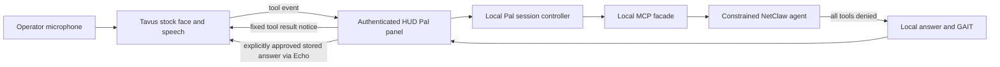

# Implementation Plan: NetClaw Pal

> Closeout amendment (2026-10-09): deliver the local Avatar slice and disabled experimental Tavus foundation. Hosted live acceptance, expanded Border integration and cloned voice are deferred to follow-up specs. See [verification.md](verification.md) for the final scope and evidence. The hosted-first plan below is retained as design history.

## Local-first implementation amendment

Owner authorized John and Lobster selectable local characters after comparing
hosted plans. Build original stylized GLB assets reproducibly in Blender (MCP
when connected; isolated Blender CLI otherwise), using a shared named-node
animation contract. Reuse existing Three.js, StandardChat, gateway routing and
HUD bindings. Add a bounded local macOS speech adapter returning audio only to
the authenticated browser. Drive the initial mouth from actual audio amplitude,
with blink/head/idle animations; do not call this phoneme-accurate lip-sync.
Default to fixed spoken status summaries, with explicit full-answer playback.
Keep cloud Tavus separately selectable and inactive unless explicitly opened.
Test ownership/origin/limits, synthesis cleanup, real audio, chat preservation,
two asset rigs, cancellation and rendering before reporting the slice complete.
Custom-avatar import/converter, local STT, cloned voice and visemes follow the
working two-character prototype.

Status: ratified; first explanation-companion slice implemented locally. No Tavus mutation or live conversation has occurred. Operational reads and live acceptance remain pending. See [implementation evidence](implementation-evidence.md).

The Tavus architecture below documents the original hosted foundation. The subsequent
approved distribution/Border scope and ordered expansion are in
[distribution-design.md](distribution-design.md). That file also records the
local Blender direction, now ratified and implemented as the local Avatar
prototype. Hosted member placement and custom training remain future work.

## Architecture

Tavus receives microphone audio and returned speech text. Screen/camera capture is off initially. No public tunnel is required for this route. A remotely hosted HUD must already have valid authentication/TLS; this spec does not publish it.

## Implemented first-slice components and contracts

- Optional `tavus-pal` installer component and isolated MCP runtime; document its read-only facade and narrowly authorized conversation lifecycle operations.
- A session controller beneath `ui/netclaw-visual/src/hud-server/` owns provider requests, usage ledger, task binding, export policy and cleanup. The following endpoints are implemented; provider/live gateway behavior is not yet accepted.
- `GET /api/pal/status`: configuration/availability and conservative allowance; no secrets.
- `POST /api/pal/sessions`: explicit start, authenticated operator, eligible stock selection, confirmed budget and CSRF/origin protection. Returns an opaque local ID and room credentials only to that operator.
- `POST /api/pal/sessions/:id/turns`: bounded tool event; accept only the configured operation and owned conversation. Deduplicate by session/call ID plus payload digest. Same ID with different arguments is rejected.
- `POST /api/pal/allowance`: current Free balance and billing-bound attestation, valid for one start within 15 minutes.
- `POST /api/pal/sessions/:id/speech/:callId`: explicit release of the exact stored answer as a bounded Echo event. No caller-supplied replacement text.
- `POST /api/pal/sessions/:id/reconcile`: find an ambiguous creation by exact server-assigned name, then end and verify it.
- Turn responses carry the local answer separately from the fixed provider event. A persistent evidence polling/resume route is deferred.
- `POST /api/pal/sessions/:id/end`: idempotent cleanup using Tavus's end operation, with confirmed status and ledger reconciliation.
- MCP request/status schemas expose no arbitrary tool execution, shell, user-selectable gateway key or endpoint. Enforce actual agent tool restrictions before enabling this facade. If the runtime cannot enforce them, the integration stays unavailable.

Use the tools registry, `delivery.app_message:true`, a fixed pending phrase and an explicit result policy. Test `response_in_result` with the SDK; if unsupported on this transport, revise the design before live release. A bare iframe is insufficient unless it exposes the required validated interaction events. The current HUD is React/Vite. It dynamically imports pinned Daily JS 0.93.0 only after explicit Start; join uses a private room token with camera off.

## Budget and lifecycle design

One persistent ledger per provider account, locked across processes. Establish a trusted current allowance from the provider/account before accepting starts. A zero conversation count does not establish balance.

Implemented call defaults: `max_call_duration:120`, `participant_absent_timeout:30`, `participant_left_timeout:0`, recording off and private room on. Validate supported ranges and semantics first. Hard call maximum: 300 seconds. A two-minute absolute local deadline is implemented; separate inactivity tracking is deferred. Absence is not inactivity.

Before creation, reserve the full capped duration plus verified setup/cleanup exposure, rounded up conservatively and never below the provider minimum. Only one unresolved reservation exists at a time. Use a 60-second provisional cushion during initial validation, reducing the allowed call duration as needed; this is a project buffer, not a provider guarantee. If billing start/end behavior cannot be bounded, block live creation.

State sequence: `reserved → creating → active → ending → ended/reconciled`; ambiguous responses enter `unknown` and retain their reservation. Do not retry creation blindly. On restart, reconcile outstanding provider IDs and ambiguous creations before allowing another start. Decrease budget by the greater of verified provider usage and the conservative local estimate; only release excess reservation with reliable evidence. Account use outside Pal must be incorporated before the next call. No calendar-only resets, automatic top-ups or background heartbeat calls.

Provider duration caps and explicit end calls protect against a crashed browser. Failure to confirm end blocks new starts until reconciled. Stopping video does not falsely mark an ongoing NetClaw read complete.

## Security, evidence and latency

The first slice requires `tools.deny: ["*"]`, a fixed agent ID and a separate reviewed bootstrap workspace. Scoped read tools and target binding remain later work. A free-form `ask_netclaw` wrapper around the unrestricted main agent is not acceptable. V1 writes and external messages remain unavailable even if Tavus, the user or a tool result requests them.

Separate public/synthetic responses from private evidence by construction. For an operational result use an approved constant such as “The check is complete; the findings are in your NetClaw panel.” Never run a general-purpose summarizer over private output and assume it has removed all sensitive information.

Bound the entire UTF-8 event below 4 KB, including its envelope; target at most 3 KB and test multibyte text. Keep full evidence local. Disable speculative dispatch; serialize utterances per bound task. Slow work is bounded by the facade timeout and room deadline; duplicate in-flight events receive a true pending notice. Persistent polling/resume is deferred. A lost connection cancels pending speech delivery, not evidence history.

## Constitution and coherence

SDD: draft → review/ratification → implementation → verification. MCP-native tool integration; no new vendor/device path. GAIT is mandatory for operational dispatch. Existing production and local/lab approval rules apply unchanged.

Before release update README, installer catalog and install function, catalog coverage, HUD panel, SOUL capability description, workspace skill, `.env.example`, TOOLS and applicable OpenClaw registration. Register a new MCP only when implementation exists; do not inflate counts during design. Keep credentials server-side and component dependencies isolated. Choose the release version after acceptance.

## Verification

Use fake Tavus HTTP/event fixtures and a constrained agent fixture for budget, identity, replay, read-only enforcement, export and lifecycle failure tests. Run relevant existing HUD/authentication tests and spec/catalog checks. Then run one owner-authorized synthetic call within the reserved two-minute window, reporting measured latency, usage and confirmed cleanup. Test live operational tools only after their own prerequisites and authorization are satisfied.
